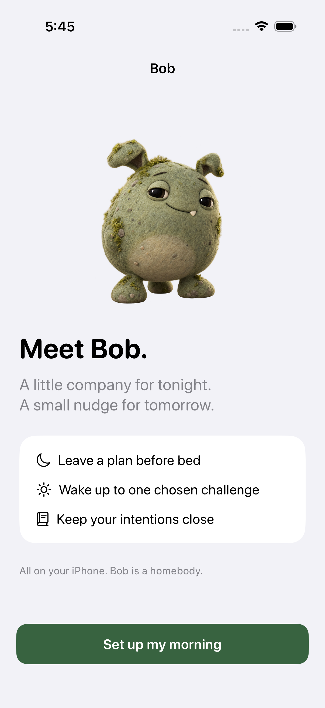
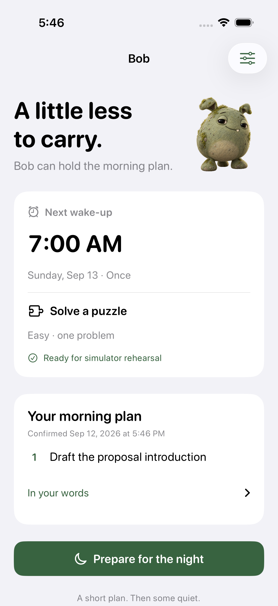
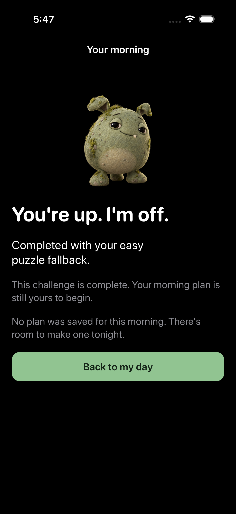

# Bob

A native iPhone companion for a short plan before bed and one chosen challenge after waking.
The app uses SwiftUI, AlarmKit, Vision, AVFoundation, and Apple's on-device Foundation Models.
It has no backend, external AI service, analytics, or paid entitlement configuration.

**Status: working local prototype.**
The initial local validation passed 58 logic tests and four simulator UI flows, plus unsigned simulator and iPhone builds.
Physical iPhone validation remains pending, and the exact background alarm cutoff has a known platform limitation described below.
There is no App Store, TestFlight, or signed release download.

<p>
  
  
  
</p>

## Build locally

The verified toolchain is Xcode 26.6, the iOS 26.5 SDK, and XcodeGen 2.46.
Bob targets iPhone with iOS 26 or later.
Local UI validation uses the iOS 26.5 iPhone 17 simulator.
Install Xcode and its iOS simulator runtime before starting.
The verification scripts also require Node.js 22 or later; `.nvmrc` selects Node 24.
No API key, backend setup, npm packages, or Apple signing account is needed for the simulator.

From the cloned repository directory:

```sh
brew install xcodegen
xcodegen generate
open Bob.xcodeproj
```

Choose the Bob scheme and an iPhone simulator, then Run.
Use the Debug-only **Try a morning** action to rehearse the configured challenge without scheduling or cancelling real alarms.
The simulator has no real camera and may not have an available on-device language model; manual planning and puzzle fallback remain usable.

## Verify

```sh
swift test
node scripts/verify.mjs build
node scripts/verify.mjs privacy
node scripts/verify.mjs device-build
node scripts/verify.mjs ui
```

The UI script chooses an installed iPhone 17 simulator, preferring one already booted.
Set `BOB_SIMULATOR_UDID` to use another installed simulator.
It boots the selected simulator when needed and waits for startup to complete before testing.
Logs and XCTest result bundles are written under `build/`.
The [implementation review](docs/IMPLEMENTATION_REVIEW.md) explains the design review and important corrections.
The [CI workflow](.github/workflows/ci.yml) runs repository checks, secret scans, logic tests, unsigned builds, and simulator UI flows on pushes to `main` and pull requests.
GitHub-hosted results will be available after the first push.
Generated Xcode project and Info.plist changes come from `project.yml` and `xcodegen generate`; the generated files are excluded from Git.
See [CONTRIBUTING.md](CONTRIBUTING.md) for focused checks and development conventions.

## What is implemented

- One alarm with a wake time, selected repeating days, and one challenge.
- Twenty seconds of verified pushup activity, an easy one-problem or hard three-problem arithmetic puzzle, or a registered QR code.
- A preselected puzzle fallback for pushups and QR, available without requiring camera failure.
- Local text preparation, brief clarification, editable suggestions, explicit plan confirmation, and a manual path.
- Saved original intentions and dated plans carried into each morning occurrence.
- Silence separately from completion, a two-minute inactivity default, four-minute puzzle thinking allowance, and bounded retry scheduling.
- Preserved accepted activity and solved puzzle progress across restarts.
- Actual completion method recorded independently of broader plan steps.
- Adaptive appearance, Dynamic Type, VoiceOver labels, native camera feedback, and permission readiness.

## Limits that still matter

The original MVP is not yet verified on a physical iPhone.
Free Personal Team signing, real locked/background alarm behavior, actual pushup reliability, and offline Foundation Models conversation quality require the later phone pass.
See [the device validation checklist](docs/DEVICE_VALIDATION.md).
Local suggestions use conservative source extraction for supported phrases.
Conditions, corrections, and unsupported wording stay verbatim for editing, and every plan requires confirmation.

The exact requirement to stop all audible sound at 15 minutes while Bob is suspended remains a known platform gap.
The code schedules no new retries after the deadline and stops current sound when executing, but AlarmKit exposes no exact alert-expiration parameter.
An already sounding system alert may need to be silenced by the user outside the app.
This limitation has not been treated as a completed MVP requirement.

Repeating primary alarms are managed by AlarmKit.
Fixed retries are queued for the next seven days and refreshed when Bob opens.
After travel, reopen Bob so fixed retries follow the current time zone.
The repeating primary alarm follows the device time zone through AlarmKit.
One-time alarms keep their originally scheduled absolute date.
Changing an alarm during an unfinished occurrence's 15-minute audible window is blocked; settings become editable after completion or the deadline.
Existing accepted progress and the active plan snapshot are preserved.

## Source layout

- `Sources/BobCore`: domain models, alarm occurrence rules, arithmetic, scheduling book, and atomic JSON storage.
- `Sources/BobPlan`: source-grounded plan suggestion validation.
- `Bob/Alarms`: AlarmKit adapter and local app intents.
- `Bob/Camera`: camera capture, QR processing, and deterministic pose detector.
- `Bob/Planning`: Foundation Models availability and generation.
- `Bob/Views`: native SwiftUI screens.
- `Bob/App`: app state, persistence orchestration, and lifecycle.
- `Tests` and `BobUITests`: public-interface behavior tests and real simulator flows.

All camera frames stay in memory on the capture queue.
Application data is stored locally in Application Support, excluded from backup, and protected until first device unlock after restart.
No camera footage is retained.

Bob's original character artwork was generated with OpenAI's image generation tool and is bundled in `Bob/Assets.xcassets`.
The original product requirements remain in [MVP_SPEC.md](MVP_SPEC.md); implemented decisions and validation boundaries are recorded in the [implementation review](docs/IMPLEMENTATION_REVIEW.md).

## License

A license has not been selected for the code, documentation, or artwork.
No open-source license is granted by this repository at this stage.
